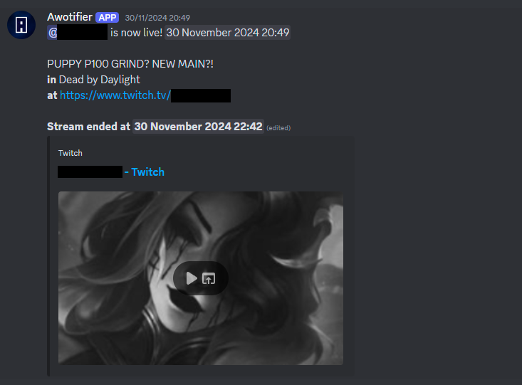

# Awotifier  

A small project to notify a Discord channel when someone goes live in a server.  

## Features  
- Sends notifications when a user goes live  
- Updates the message with an ending time when they go offline  
- Simple and lightweight  

  

## Source Code  
The source code is available in the `src` directory.  

## Getting Started  
1. Create a `.env` file in your project directory and add the following line:  

   ```env
   TOKEN=your_discord_bot_token_here
   ```  

2. Replace `your_discord_bot_token_here` with the actual token from the [Discord Developer Portal](https://discord.com/developers/applications).  

